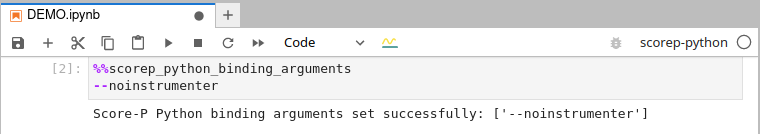
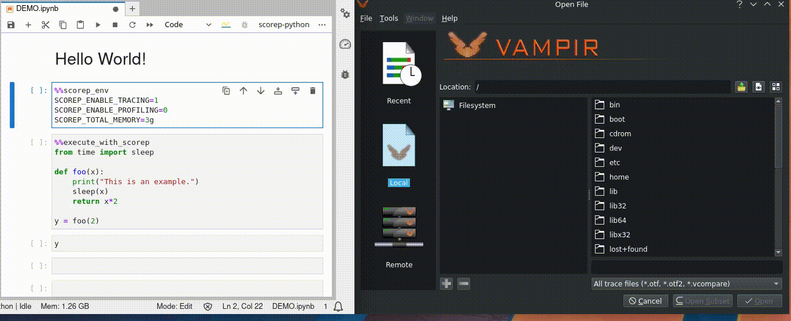
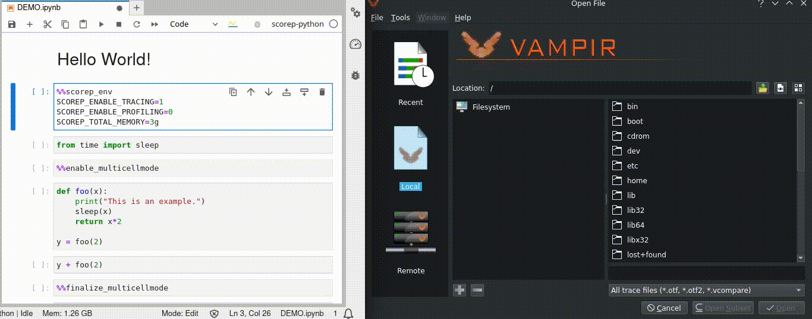

[](https://github.com/score-p/scorep_jupyter_kernel_python/actions/workflows/unit_test.yml)
[](https://github.com/score-p/scorep_jupyter_kernel_python/actions/workflows/formatter.yml)
[](https://github.com/score-p/scorep_jupyter_kernel_python/actions/workflows/linter.yml)

<p align="center">

</p>

# A Jupyter Kernel for Score-P Instrumentation

This is the JUmPER Kernel that enables you to instrument and trace or profile Jupyter cells with [Score-P](https://score-p.org/).

The kernel uses the [Score-P Python bindings](https://github.com/score-p/scorep_binding_python) to provide fine-grained performance analysis capabilities directly within Jupyter notebooks.

# Table of Content

- [A Jupyter Kernel for Score-P Instrumentation](#a-jupyter-kernel-for-score-p-instrumentation)
- [Table of Content](#table-of-content)
- [Installation](#installation)
- [Usage](#usage)
  - [Score-P Instrumentation](#score-p-instrumentation)
    - [Configuring Score-P in Jupyter](#configuring-score-p-in-jupyter)
  - [Multi-Cell Mode](#multi-cell-mode)
  - [Write Mode](#write-mode)
- [Presentation of Performance Data](#presentation-of-performance-data)
- [Limitations](#limitations)
  - [Serialization Type Support](#serialization-type-support)
  - [Overhead](#overhead)
- [Future Work](#future-work)
- [Citing](#citing)
- [Contact](#contact)
- [Acknowledgments](#acknowledgments)

# Installation

To install the kernel:

```
pip install jumper-kernel
python -m jumper.install
```

You can also build the kernel from source via:

```
pip install .
```

The kernel will then be installed in your active python environment.
You can select the kernel in Jupyter as `jumper`.

**For using the Score-P features of the kernel you need a proper Score-P installation.**

```
pip install scorep
```

From the Score-P Python bindings:

> You need at least Score-P 5.0, build with `--enable-shared` and the gcc compiler plugin.
> Please make sure that `scorep-config` is in your `PATH` variable.
> For Ubuntu LTS systems there is a non-official ppa of Score-P available: https://launchpad.net/~andreasgocht/+archive/ubuntu/scorep .

# Usage

## Score-P Instrumentation

### Configuring Score-P in Jupyter

Set up your Score-P environment with `%env` line magic, e.g.:
```
%env SCOREP_ENABLE_TRACING=1
%env SCOREP_TOTAL_MEMORY=3g
```
For a documentation of Score-P environment variables, see: [Score-P Measurement Configuration](https://perftools.pages.jsc.fz-juelich.de/cicd/scorep/tags/latest/html/scorepmeasurementconfig.html).

`%%scorep_python_binding_arguments`

Set the Score-P Python bindings arguments. For a documentation of arguments, see [Score-P Python bindings](https://github.com/score-p/scorep_binding_python).



`%%marshalling_settings`

Set marshaller/serializer used for persistence and mode of communicating persistence between notebook and subprocess. Currently tested marshallers: `dill`, `cloudpickle`; modes of communication: `disk`, `memory`. If no arguments were provided, will print current configuration. Use:
```
%%marshalling_settings
MARSHALLER=[dill,cloudpickle]
MODE=[disk,memory]
```

When using persistence in `disk` mode, user can also define directory to which serializer output will be saved with `SCOREP_KERNEL_PERSISTENCE_DIR` environment variable.

`%%execute_with_scorep`

Executes a cell with Score-P, i.e. it calls `python -m scorep <cell code>`



## Multi-Cell Mode
You can also treat multiple cells as one single cell by using the multi cell mode. Therefore you can mark the cells in the order you wish to execute them.

`%%enable_multicellmode`

Enables the multi-cell mode and starts the marking process. Subsequently, "running" cells will not execute them but mark them for execution after `%%finalize_multicellmode`.

`%%finalize_multicellmode`

Stop the marking process and executes all the marked cells.
All the marked cells will be executed with Score-P.

`%%abort_multicellmode`

Stops the marking process, without executing the cells.

**Hints**:
- The `%%execute_with_scorep` command has no effect in the multi cell mode.

- There is no "unmark" command available but you can abort the multicellmode by the `%%abort_multicellmode` command. Start your marking process again if you have marked your cells in the wrong order.

- The `%%enable_multicellmode`, `%%finalize_multicellmode` and `%%abort_multicellmode` commands should be run in an exclusive cell. Additional code in the cell will be ignored.



## Write Mode

Analogous to [%%writefile](https://ipython.readthedocs.io/en/stable/interactive/magics.html#cellmagic-writefile) command in IPykernel, you can convert a set of cells to the Python script which is to be executed with Score-P Python bindings (with settings and environment described in auxillary bash script).

`%%start_writefile [scriptname]`

Enables the write mode and starts the marking process. Subsequently, "running" cells will not execute them but mark them for writing into a python file after `%%end_writefile`.
`scriptname` is `jupyter_to_script.py` by default.

`%%end_writefile`

Stop the marking process and write the marked cells to the Python script.

`%%abort_writefile`

Stops the marking process, without writing the cells.

# Presentation of Performance Data

To inspect the collected performance data, use tools as Vampir (Trace) or Cube (Profile).

# Limitations

## Serialization Type Support

 **Serialization with Dill package**

Serialization support is a major limitation for any multi-process approach.
In essence, the limitation is bound to what can be pickled by dill.
The typical limitation is the usage of lambda functions. Lambda function that are not notebook-defined cannot be pickled and will cause an error. 
There are two solutions to this limitation: (a) Use named functions instead of lambda functions (b) Use only notebook-defined lambda functions.

Lambda function that are defined in the notebook can be pickled, as they can be re-imported from the subprocess.

**Serialization with cloudpickle package**

Cloudpickle is another serialization package. Some lambda functions might be serializable with cloudpickle when they are not serializable with dill. For the exact limitation with cloudpickle package please refer to their documentation.

## Overhead

The overhead of serialization (in particular dill) and subprocess call for Score-P is not negligible and the approach is recommended only for the Score-P code.

# Future Work

- Add support for other serialization packages
- Enable tracing cell execution dependencies

# Citing

If you publish results obtained with the help of JUmPER, please cite the following paper:

Elias Werner and Andreas Gocht and Jan Eitzinger and Georg Hager and Gerhard Wellein. "JUmPER: A Jupyter Kernel for Performance Engineering". In: 14th Workshop on Parallel Systems and Algorithms (PASA 2023), Hamburg, Germany.

# Contact

If you have any questions about JUmPER, please contact Elias Werner (elias.werner@tu-dresden.de).

# Acknowledgments

We would like to thank the [Score-P](https://score-p.org/) team for their ongoing support.


